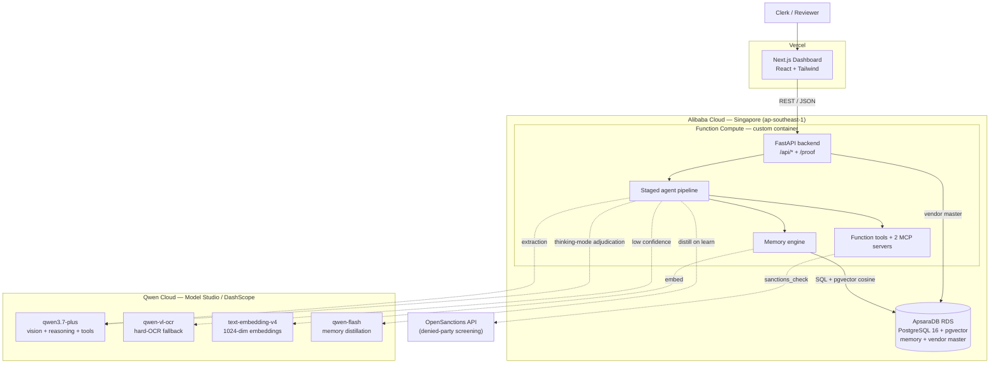
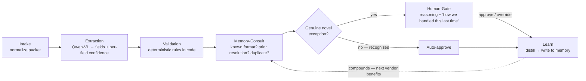
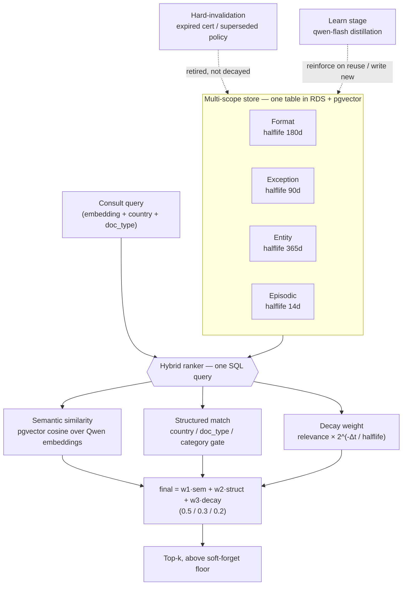

# Patina — Architecture

> Onboarding that gets sharper every time. Patina onboards a supplier's messy
> document packet, validates it against policy, routes only genuine novel exceptions
> to a human — and **gets measurably better every time** by remembering document
> formats, false‑flag patterns, and how humans resolved prior exceptions.

Everything below is **live**, not aspirational: the full stack runs on Alibaba Cloud
(Function Compute + ApsaraDB RDS) calling Qwen Cloud, with the frontend on Vercel.

---

## 1. System topology (deployment)

**Cloud service mapping**

| Concern | Service |
|---|---|
| Compute / API | **Function Compute** (custom‑container runtime, HTTP trigger) |
| Model access (vision, reasoning, embeddings, tools) | **Model Studio / DashScope** (Singapore) |
| Memory store + vendor master (relational **and** vectors, one store) | **ApsaraDB RDS PostgreSQL + pgvector** |
| Frontend hosting | **Vercel** (calls the Alibaba backend) |
| Denied‑party screening | **OpenSanctions** public API (with local fallback) |

---

## 2. The agent pipeline

A staged pipeline with **explicit, persisted state** (not one mega‑prompt). Each stage
is a discrete module with its own error handling and fallback. The Human‑Gate guards
every side‑effectful memory write.

**Resilience (graceful degradation, demonstrated):** low extraction confidence →
OCR fallback then flag for human; empty memory retrieval → proceed without a
suggestion; external tool failure (e.g. sanctions API) → local fallback + surface.
`tenacity` retries wrap all model/tool calls.

---

## 3. The memory engine (the differentiator)

Custom‑built — **not** an off‑the‑shelf memory API. Four scopes with different
retrieval patterns and decay rates, hierarchical distillation (compact facts, not
transcripts), a multi‑signal hybrid ranker, and a separate hard‑invalidation layer.

**Why each piece is non‑trivial (the anti‑'vector‑store wrapper' argument):**

- **Multi‑scoped**, because format layouts, exception resolutions, known entities and
  raw cases have genuinely different retrieval patterns and decay rates.
- **Decay = time × usefulness**, not pure time (would forget rare‑but‑critical rules)
  nor pure frequency (would keep stale‑but‑common ones). Relevance fades with time but
  **resets on successful reuse** (spaced‑repetition analogy). True half‑life curve.
- **Hard‑invalidation is separate from decay**: decay handles *fading relevance*;
  invalidation handles *known‑wrong* (an expired cert is retired immediately, not faded).
- **Hybrid retrieval** combines three signals in one SQL query, because pure vector
  similarity over‑retrieves semantically‑close‑but‑structurally‑wrong cases (a Chinese
  and a Japanese registration sit close in embedding space, but the rules differ) — the
  structured match is a corrective gate; decay breaks ties toward what's currently trusted.

---

## 4. The compounding demo (what the memory buys)

Three scenarios, each targeting a different memory mechanism. Human‑touches fall to
zero as the agent recognizes repeated patterns:

| Scenario | Memory mechanism | Human‑touches per vendor | Beat |
|---|---|---|---|
| **A** — multilingual (CJK) | **Format** | `1, 0, 1, 0` | Learns Chinese 营业执照, then Japanese 履歴事項証明書 — *separately* |
| **B** — trading‑name trap | **Exception** | `1, 0, 0, 0` | Stops crying wolf: repeat holder‑name mismatches suppressed to a note |
| **C** — expiring insurance | **Decay / invalidation** | `0, 1, 1, 0` | Knows when its own memory has gone stale (expiring‑soon + expired) |

---

## 5. Model selection (per stage)

Deliberate per‑task selection — an engineering‑judgment and cost signal.

| Stage | Model | Mode |
|---|---|---|
| Extraction (primary) | `qwen3.7-plus` | Multimodal, structured JSON + confidence |
| Extraction (fallback) | `qwen-vl-ocr` | Specialist OCR when confidence is low |
| Validation reasoning (fuzzy) | code first; `qwen3.7-plus` only where needed | Arithmetic/dates stay in Python |
| Novel‑exception adjudication | `qwen3.7-plus` | Native function‑calling over the tools, used sparingly |
| Memory distillation | `qwen-flash` | Compress a resolved case → one memory item |
| Retrieval embeddings | `text-embedding-v4` | 1024‑dim semantic signal |
